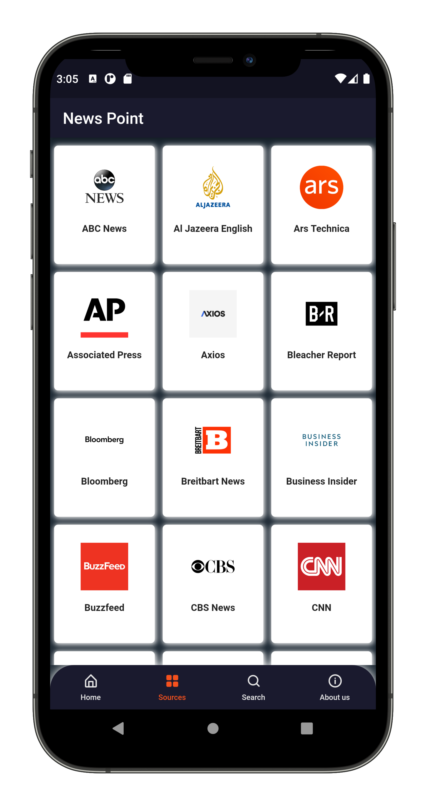
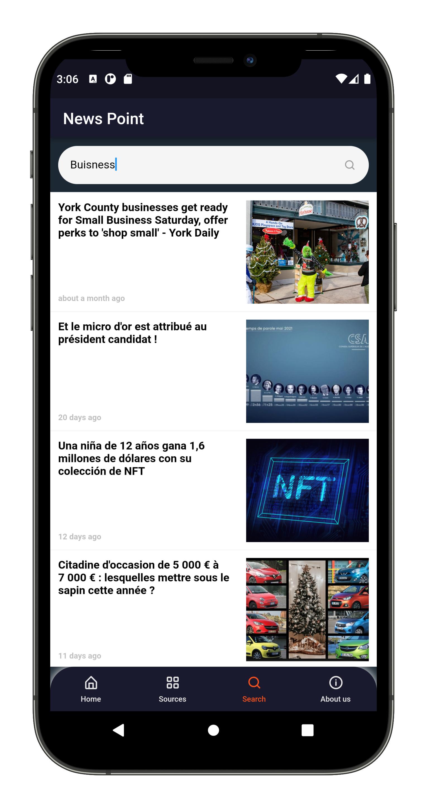
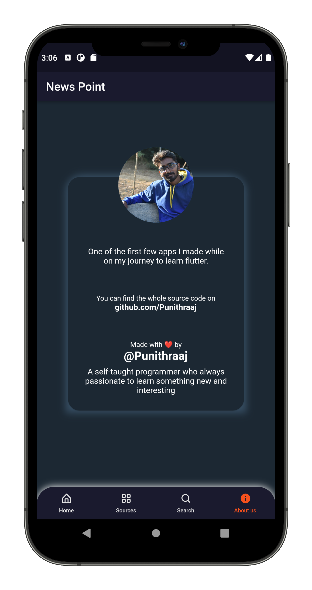

# News Point – Flutter News app with Newsapi

App has a simple clean UI which and a UX. App follows app design conventions and the source is modular where you can easily tweek and do changes to the app.

**Packages we are using:**

- cupertino_icons: [link](https://pub.dev/packages/cupertino_icons)
- newsapi: [link](https://pub.dev/packages/newsapi)
- hexcolor: [link](https://pub.dev/packages/hexcolor)
- eva_icons_flutter: [link](https://pub.dev/packages/eva_icons_flutter)
- carousel_slider: [link](https://pub.dev/packages/carousel_slider)
- timeago: [link](https://pub.dev/packages/timeago)
- rxdart: [link](https://pub.dev/packages/rxdart)
- flutter_html: [link](https://pub.dev/packages/flutter_html)
- url_launcher: [link](https://pub.dev/packages/url_launcher)

**Screens it contains:**

=> Home Screen

=> Source Screen

=> Search Screen

=> About Us Screen

**Some Feature:**
- Zero Cost for daily latest news apis
- Get updated news after every 3 min
- Get news with images and articles
- AUTO GETTING NEWS FROM NEWSAPI
- AUTO CACHE IMAGES, NEWS.
- AUTO MARKING NEWS AS FEATURED.
- AUTO DELETING EXPIRED NEWS.
- Beautiful Material Design.
- Bottom Navigation
- Banner Slider
- HOt News
- Suggested News
- Categories
- Internal Browser for read news.
- and more

Now it contains all the screen, thanks for your love and support 🙏 

## Photos

